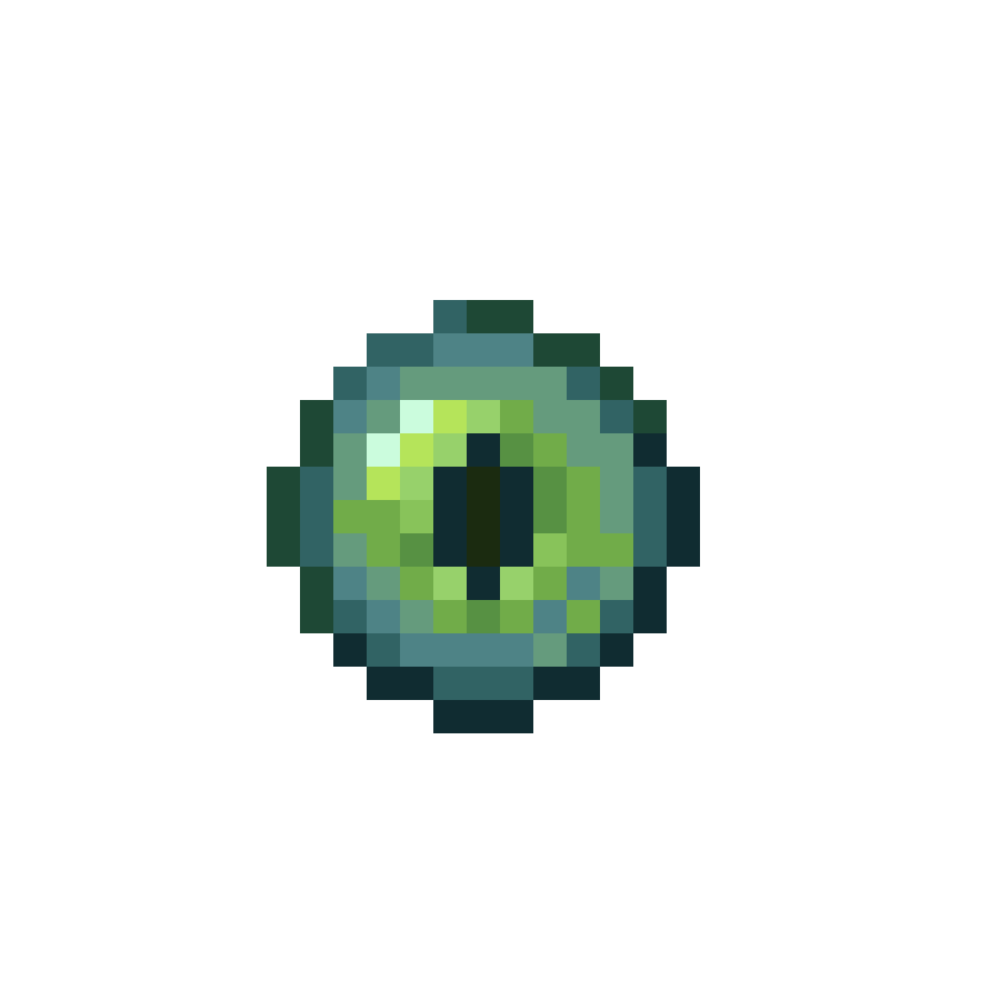
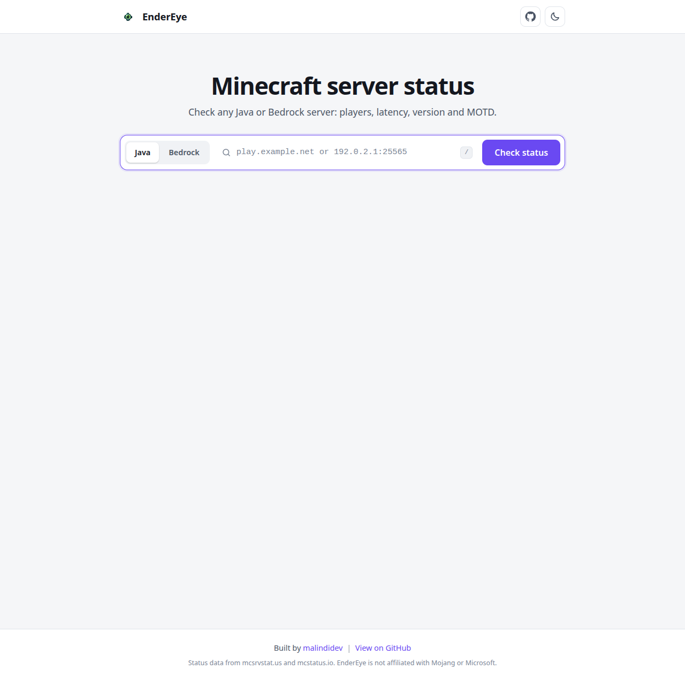

<div align="center">



# EnderEye

Fast, clean Minecraft server status checker for Java and Bedrock.

[Live site](https://ee.bbnerds.com) | [Report a bug](https://github.com/malindidev/EnderEye/issues) | [Author](https://github.com/malindidev)


</div>

## Overview

EnderEye lets you look up any Minecraft Java or Bedrock server by address or IP and see its live status in one card: online state, player count, latency, version, formatted MOTD and server icon. It is a static frontend built with vanilla HTML5, modern CSS3 and ES6+ modules. There is no build step and no runtime dependency.

## Screenshot



## Features

- Java and Bedrock edition support
- Online or offline status with a clear badge
- Player count with a usage meter and a list of online players when the server exposes it
- Latency indicator with signal bars
- Server version, software and protocol number
- Full Minecraft MOTD rendering, including colors, bold, italic, underline, strikethrough and obfuscated text
- Server icon, with a branded fallback when a server has none
- One click copy of the server address with instant visual feedback
- Shareable links such as `?server=play.example.net&edition=java`
- Recent searches saved locally in your browser
- Light and dark theme toggle that follows your system preference and remembers your choice
- Multi provider fallback chain so lookups keep working when one API is down or blocked
- Loading skeletons, request cancellation, timeouts and readable error messages
- Keyboard shortcut: press `/` to focus the search box
- Responsive layout, accessible markup and reduced motion support

## How the fallback chain works

Requests are tried in order until one returns a usable response:

| Order | Provider | Route |
| ----- | -------- | ----- |
| 1 | [mcsrvstat.us](https://mcsrvstat.us) | Direct |
| 2 | [mcstatus.io](https://mcstatus.io) | Direct |
| 3 | mcsrvstat.us | Through a public CORS proxy |
| 4 | mcstatus.io | Through a public CORS proxy |

A provider is skipped on a timeout, network error, HTTP error (including 429 rate limits) or a malformed response. Each provider has its own parser that feeds one shared data format, so the UI never depends on a specific API. The result card shows which source answered.

Latency is the round trip time to the status API, not a direct ping to the Minecraft server, because these APIs do not expose a raw server ping.

## Project structure

```
.
├── index.html
├── css/
│   └── styles.css
├── img/
│   ├── endereye.png
│   └── screenshot.png
└── js/
    ├── main.js          App entry point and event wiring
    ├── api.js           Provider chain, timeouts, normalization
    ├── providers.js     API endpoints and response parsers
    ├── ui.js            DOM rendering and UI state
    ├── theme.js         Light and dark theme handling
    ├── motd.js          Minecraft formatting code renderer
    ├── validation.js    Address cleaning and validation
    ├── storage.js       Recent searches in localStorage
    ├── clipboard.js     Clipboard with legacy fallback
    ├── config.js        Constants and thresholds
    └── errors.js        Shared error type
```

## Running locally

The app uses ES modules, so it must be served over HTTP. Opening `index.html` directly from the file system will not work.

```bash
git clone https://github.com/malindidev/EnderEye.git
cd EnderEye

npx serve
```

You can also use any static server:

```bash
python3 -m http.server 8000
```

Then open the local address the server prints.

## Deployment

EnderEye is a fully static site and deploys anywhere that serves static files.

### Vercel

1. Import the repository in Vercel.
2. Set the framework preset to **Other**.
3. Leave the build command and output directory empty.
4. Deploy.

Make sure the logo is committed at exactly `img/endereye.png`, since Vercel serves from a case sensitive file system.

### Optional `vercel.json`

```json
{
  "cleanUrls": true,
  "headers": [
    {
      "source": "/(.*)",
      "headers": [
        { "key": "X-Content-Type-Options", "value": "nosniff" },
        { "key": "Referrer-Policy", "value": "strict-origin-when-cross-origin" }
      ]
    },
    {
      "source": "/(css|js)/(.*)",
      "headers": [
        { "key": "Cache-Control", "value": "public, max-age=3600, must-revalidate" }
      ]
    }
  ]
}
```

### Content Security Policy

If you add a strict CSP, allow these origins:

- `connect-src`: `https://api.mcsrvstat.us`, `https://api.mcstatus.io`, `https://api.allorigins.win`
- `img-src`: `data:` (server icons are delivered as data URIs)

## Configuration

Common settings live in `js/config.js`:

| Setting | Purpose | Default |
| ------- | ------- | ------- |
| `REQUEST_TIMEOUT_MS` | Time allowed per provider before falling back | `8000` |
| `MAX_RECENT` | Number of saved recent searches | `6` |
| `MAX_PLAYERS_SHOWN` | Player names displayed before showing "+N more" | `24` |
| `LATENCY_LEVELS` | Thresholds for the latency bars | 120, 300, 600 ms |

To add or reorder providers, edit `js/providers.js`. Each provider needs a `url` builder and a `parse` function that returns the shared shape.

## Browser support

Any current version of Chrome, Edge, Firefox or Safari. The clipboard button uses the async Clipboard API on HTTPS and falls back to a legacy method elsewhere.

## Notes

- The public CORS proxy used in the last two fallbacks is a best effort safety net. For heavy traffic, consider adding your own serverless proxy function.
- Status data comes from third party APIs, so accuracy and uptime depend on them.

## Credits

- Built by [malindidev](https://github.com/malindidev)
- Status data from [mcsrvstat.us](https://mcsrvstat.us) and [mcstatus.io](https://mcstatus.io)

EnderEye is not affiliated with, endorsed by, or associated with Mojang Studios or Microsoft. Minecraft is a trademark of Mojang Studios.

## License

Released under the [MIT License](LICENSE).
